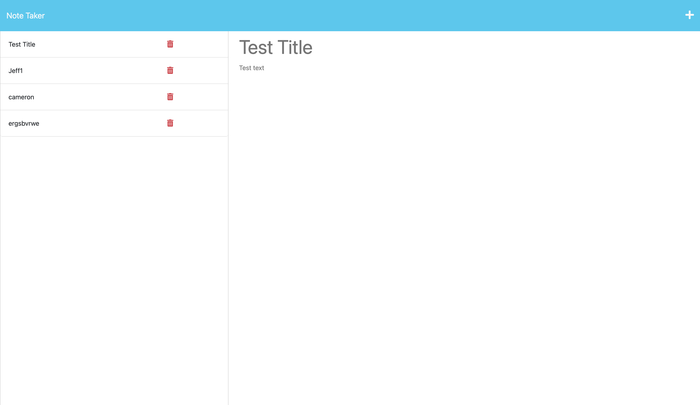

# Note Taker

[](https://github.com/treesaretall)

Note Taker is a web application that allows users to write and save notes. It uses an Express.js back end to handle data storage and retrieval from a JSON file. This application is designed to help small business owners organize their thoughts and keep track of tasks they need to complete.



## Installation

To use Note Taker locally, follow these steps:

1. Clone the repository: `git clone https://github.com/treesaretall/note-taker.git`
2. Navigate to the project directory: `cd note-taker`
3. Install the dependencies: `npm install`

## Usage

To start using Note Taker, run the following command in the project directory:

```
npm start
```

Then, open your web browser and visit `http://localhost:3000` to access the application.

## Technologies Used

- Node.js
- Express.js
- HTML
- CSS
- JavaScript

## Folder Structure

- `public`: Contains static assets such as CSS files and client-side JavaScript.
- `routes`: Defines the routes for handling HTTP requests.
- `db`: Stores the JSON file used for data storage.
- `server.js`: Entry point for the application.

## Contributing

If you would like to contribute to Note Taker, follow these steps:

1. Fork the repository.
2. Create a new branch for your feature: `git checkout -b my-new-feature`
3. Make your changes and commit them: `git commit -m "Add some feature"`
4. Push the branch to your forked repository: `git push origin my-new-feature`
5. Submit a pull request.

## License

This project is licensed under the [MIT License](LICENSE).

## Contact

If you have any questions or suggestions, feel free to reach out to me through my [GitHub profile](https://github.com/treesaretall).

Thank you for using Note Taker!
